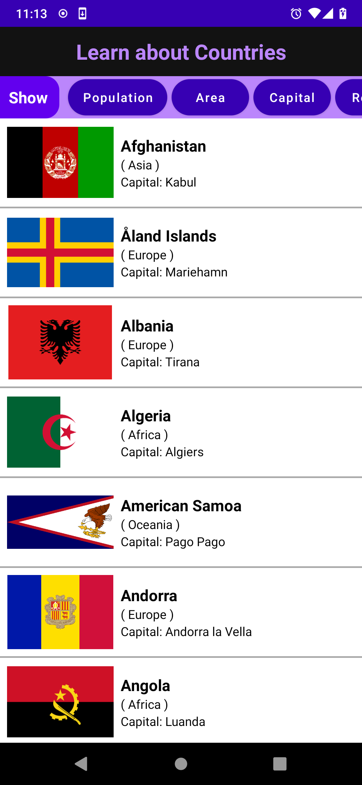

<h1>Learn about Countries (Just started - Need some weeks)</h1>
<h2>Android App - refreshing my Android Skills and also showcasing</h2>

<h2>Todos</h2>
<ul>
  <li><del>Sort</del> <ins>Show Columns</ins> Functionality - UI Improvement</li>
  <ul>
    <li>When user selects a field on Show-bar, it will be showed on the countries-list view</li>
    <li>Add Up-Down arrow somewhere to showcase the sorting in decreasing/increasing</li>
  </ul>
  <li>Fetch and Save and Periodically check for updates</li>
    <ul>
      <li>Choose a stable API for updated country data if possible</li>
      <li>Use room-db for database</li>
      <li>Add Periodic Update logic</li>
    </ul>
  <li>Add search option</li>
  <li>Lots of Todos (Just started)</li>
</ul>

<h2>Screenshot</h2>

Thanks to &#128154; <a href="https://github.com/CatalinStefan">Catalin Stefan</a> &#128154; and his <a href="https://www.udemy.com/course/modernandroidappjava/">Udemy Course</a> which I used as the base for this project.
